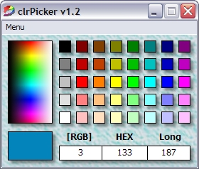



## clrPicker v1\.2

### Description

I get totally pissed of to find long value colors for vb programs. So i made this awesome clrPicker with long, hex and rgb color values. It's small but useful...
 
### More Info
 
No side effects...

             |
---                |---
**Submitted On**   |2002-09-27 15:00:54
**By**             |[huovinha](https://github.com/Planet-Source-Code/PSCIndex/blob/master/ByAuthor/huovinha.md)
**Level**          |Beginner
**User Rating**    |4.7 (28 globes from 6 users)
**Compatibility**  |VB 6\.0
**Category**       |[Complete Applications](https://github.com/Planet-Source-Code/PSCIndex/blob/master/ByCategory/complete-applications__1-27.md)
**World**          |[Visual Basic](https://github.com/Planet-Source-Code/PSCIndex/blob/master/ByWorld/visual-basic.md)
**Archive File**   |[clrPicker\_1508551252002\.zip](https://github.com/Planet-Source-Code/huovinha-clrpicker-v1-2__1-39606/archive/master.zip)

